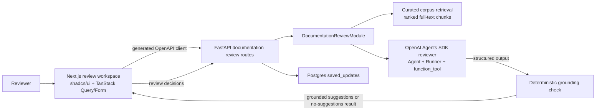

# Pluno Documentation Review Challenge

This repository implements the Pluno AI/backend take-home challenge on top of
`vintasoftware/nextjs-fastapi-template`.

The product turns a natural-language documentation update request into
grounded, reviewable edit suggestions for OpenAI Agents SDK documentation. A
user can generate suggestions, inspect source evidence, edit the replacement
text, approve or reject each suggestion, and save the reviewed update.

## Problem Solved

Documentation drifts when APIs and product behavior change. The app helps a
maintainer answer:

- Which documentation page likely needs to change?
- What exact excerpt should be replaced?
- Why is this suggestion grounded in the docs?
- What final reviewed update should be saved for later application?

The saved result is not just an AI note. It stores before-and-after excerpts,
evidence, reviewer decisions, and final replacement text.

## Architecture



Backend ownership is intentionally deep:

- `fastapi_backend/app/documentation_review/corpus/` contains committed Agents
  SDK documentation snapshots for deterministic demos and tests.
- `retrieval.py` ranks local markdown chunks before the model call.
- `reviewer_agent.py` uses the Python OpenAI Agents SDK with a documentation
  search tool and structured output.
- `validation.py` rejects ungrounded suggestions before the frontend sees them.
- `repository.py` persists reviewed updates in Postgres.

Frontend ownership stays focused:

- `/` is the review workspace.
- TanStack Query owns server state and mutations.
- TanStack Form owns the request input; local review state owns decisions and
  replacement text so approve/reject interactions cannot reset the final saved
  payload. The reviewer returns one generated review title for the whole
  session; saved rows use only that title as their visible label.
- The saved panel lists compact history rows and loads the full persisted review
  when a row is selected.
- shadcn/ui primitives provide the design system.
- The generated OpenAPI client keeps the frontend/backend contract typed.

## AI Pipeline

1. Load committed target documentation snapshots.
2. Retrieve the most relevant chunks with ranked in-process full-text search.
3. Run one focused OpenAI Agents SDK reviewer agent.
4. Allow the agent to call `search_documentation` for extra corpus lookup.
5. Require structured `EditSuggestion` output.
6. Run backend grounding checks:
   - source path must exist
   - original excerpt must match the target source
   - suggestion count is capped
   - ungrounded output becomes a no-suggestions result
7. Return suggestions for human review.

I chose one reviewer agent instead of multi-agent orchestration because the
challenge asks for reasonable suggestions for straightforward requests. The
current hard problem is grounding and reviewability, not delegation. Production
could add specialist verifier/export agents after deterministic checks and
evals exist.

## Setup

Start the databases:

```bash
docker compose up -d db db_test mailhog
```

Install backend dependencies and migrate:

```bash
cd fastapi_backend
uv sync
uv run alembic upgrade head
```

Configure backend environment:

```bash
cp .env.example .env
```

Set `OPENAI_API_KEY` in `fastapi_backend/.env`. The key is intentionally not
committed. `OPENAI_MODEL` defaults to `gpt-5.5` and can be changed in env.

Install frontend dependencies:

```bash
cd nextjs-frontend
pnpm install
```

Configure frontend environment:

```bash
cp .env.example .env
```

`NEXT_PUBLIC_API_BASE_URL` should point at the backend, usually
`http://localhost:8000`.

## Run Locally

Backend:

```bash
cd fastapi_backend
PYTHONPATH=. uv run fastapi dev app/main.py --host 0.0.0.0 --port 8000
```

Frontend:

```bash
cd nextjs-frontend
pnpm run dev
```

Open `http://localhost:3000`.

## API Surface

- `POST /documentation-reviews/suggestions`
- `POST /documentation-reviews/saved-updates`
- `GET /documentation-reviews/saved-updates`
- `GET /documentation-reviews/saved-updates/{saved_update_id}`

The OpenAPI schema is generated from FastAPI and consumed by the Next.js client.

## Verification

Backend:

```bash
cd fastapi_backend
uv run ruff format app tests alembic_migrations
uv run ruff check app tests alembic_migrations
uv run mypy
uv run pytest -q
```

Frontend:

```bash
cd nextjs-frontend
pnpm audit --prod
pnpm run tsc
pnpm run lint
pnpm exec jest --runInBand
pnpm run build
```

The current suite includes backend retrieval, grounding, and route workflow
tests plus a frontend review-state payload test.

## Speed Tradeoffs

Implemented for the take-home:

- committed curated corpus instead of live crawling on every request
- ranked full-text retrieval instead of a vector database
- synchronous suggestion generation
- one focused reviewer agent
- JSON persistence for reviewed suggestions
- unauthenticated challenge workspace

Why these tradeoffs:

- They keep the demo deterministic and easy to review.
- They put effort into the AI quality path: retrieval, structured output,
  grounding, and reviewability.
- They avoid infrastructure that would not improve the take-home result within
  the available time.

## Production Changes

For production I would add:

- authentication and workspace/team authorization
- encrypted secret management and key rotation
- hybrid retrieval: Postgres full-text plus embeddings/vector search
- async jobs and progress updates for long documentation reviews
- corpus refresh jobs with freshness checks and source versioning
- automated evals for retrieval recall, grounding precision, and suggestion
  usefulness
- tracing for retrieval chunks, tool calls, model output, and validation drops
- rate limits, abuse protection, and per-workspace quotas
- normalized suggestion tables if analytics, assignment, or audit workflows grow
- export/apply flows that open documentation PRs after human approval
- optional verifier/export agents once deterministic checks are already strong

## Template Attribution

This project is based on
[vintasoftware/nextjs-fastapi-template](https://github.com/vintasoftware/nextjs-fastapi-template).
The original template auth/dashboard code remains, but the challenge workflow
opens directly at `/`.
